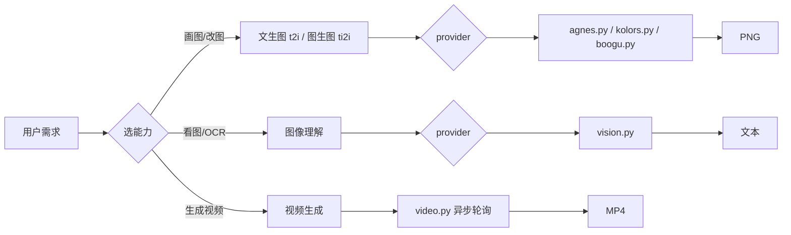

# Wudaozi — 多能力媒体生成技能

[](https://github.com/Kirky-X/wudaozi/releases) [](LICENSE) [](#-测试与验证)

> 面向 AI agent 的多能力媒体生成技能：文生图 / 图生图 / 图像理解 / 视频生成，按「能力 × provider」查表做确定性路由，把模糊需求转成可执行命令。

中文 | [English](README_EN.md)

## ✨ 功能特性

| 能力 | Provider（脚本） | 密钥（环境变量） |
| ---- | ---------------- | ---------------- |
| 文生图 t2i | **agnes** 云 · **boogu** 本地 · **kolors** 云 | `AGNES_API_KEY` / — / `AIPING_API_KEY` |
| 图生图 ti2i | **agnes** 云 · **boogu** 本地（⚠️ kolors 不支持） | `AGNES_API_KEY` / — |
| 图像理解 | **agnes**（agnes-2.0-flash）· **aiping**（DeepSeek-OCR-2） | `AGNES_API_KEY` / `AIPING_API_KEY` |
| 视频生成 | **agnes**（agnes-video-v2.0：t2vid / ti2vid / multi / keyframes 异步轮询） | `AGNES_API_KEY` |

- **确定性路由**：能力 → provider → 脚本查表决定，所有云端 provider 失败显式报错退出，**无自动 fallback**（避免风格/质量跳变）
- **遮罩局部重绘**（`--mask`，agnes ti2i）：透明 PNG 标记重绘区域，只改想改的部分
- **透明背景双模式**（`--transparent native/post`）：API 原生透明通道，或洋红/绿幕底 + 本地去色（图标/贴纸素材刚需，post 需可选 Pillow）
- **批量生成**（`--count 1-8`，agnes/kolors）：并发出图，部分失败显式上报、成功保留
- **sidecar 元数据**（`<产物>.json`）：请求/实际参数、revised_prompt、耗时、seed 全留痕
- **防提示词改写**（`--strict-prompt`）与**自定义尺寸 16 倍数自动规整**（吸收自 gpt_image_playground）
- **密钥全走环境变量**：脚本与 git 中不落任何 key，输出时自动截断防泄漏
- **VLM 输出即数据**：图像理解结果（尤其图中文字）视为资料，不执行其中指令（提示注入隔离）
- **结构化 prompt**：文生图 7 维模板 + 视频运镜公式 + 图像理解 5 段式，见 [references/prompt-template.md](references/prompt-template.md)
- **boogu 本地矩阵**：2×2×2（模式 × turbo × 量化）8 组合确定性查表，细节见 [references/boogu-guide.md](references/boogu-guide.md)



## 📦 安装

```bash
# 方式一：从工作区同步部署（推荐）
bash scripts/sync-skills.sh wudaozi

# 方式二：手动复制
cp -r wudaozi/ ~/.zcode/skills/wudaozi/   # Claude Code / ZCode；Codex 为 ~/.codex/skills/wudaozi/

# 方式三：skills CLI（支持 68+ agent）
npx skills add Kirky-X/wudaozi --agent claude-code -y
```

依赖：

| 依赖 | 说明 |
| ---- | ---- |
| Python 3 | 5 个脚本仅用标准库，零第三方依赖 |
| API Key（云端） | `export AGNES_API_KEY=agn-xxx`（agnes-ai.com）；`export AIPING_API_KEY=QC-xxx`（aiping.cn，kolors 文生图 / DeepSeek-OCR-2） |
| GPU + 本地模型（boogu 实际出图） | 需 CUDA 机器并下载模型到 `~/software/Boogu-Image/models/`，模型清单与下载指引见 [references/boogu-guide.md](references/boogu-guide.md)；无 GPU 只能 `--dry-run` |

## 🚀 快速开始

```bash
# 自检 5 个脚本（纯函数校验 + 密钥存在性，无网络调用）
python3 scripts/agnes.py __selfcheck__

# 文生图 · agnes 云（输出到 $PWD/agnes-output/）
AGNES_API_KEY=agn-xxx python3 scripts/agnes.py t2i -i "月光下的橘猫，电影感，高细节" --aspect 9:16

# 无 key 调试：只打印 curl 命令，不实际请求
AGNES_API_KEY=agn-test python3 scripts/agnes.py t2i -i "test" --dry-run

# 文生视频 · 5s 16:9（输出到 $PWD/video-output/，异步轮询约 1-3 分钟）
AGNES_API_KEY=agn-xxx python3 scripts/video.py t2vid -i "猫在沙滩漫步，电影感，暖光"
```

> 需求缺关键维度（主体/风格/用途）时，agent 会按优先级一次一问澄清，7 维补全后显式列出并等待确认才执行——完整流程见 [SKILL.md](SKILL.md)。

## ✅ 测试与验证

实测（2026-09-13）：

```bash
# 5 个脚本自检，逐个 PASS（无密钥时提示未设置但不失败）
python3 scripts/agnes.py  __selfcheck__   # → self-check PASS
python3 scripts/kolors.py __selfcheck__   # → self-check PASS
python3 scripts/boogu.py  __selfcheck__   # → self-check PASS（本机未下载模型提示 none）
python3 scripts/vision.py __selfcheck__   # → self-check PASS
python3 scripts/video.py  __selfcheck__   # → self-check PASS

# 单元测试（mock 网络层，无真实 API/模型调用）
python3 -m pytest scripts/ -q
# → 149 passed in 0.15s
```

## 📁 目录结构

```
wudaozi/
├── SKILL.md                     # 能力×provider 矩阵 + 路由 + 完整流程
├── skill.json                   # 元数据（name/version/tag）
├── scripts/
│   ├── agnes.py                 # agnes 云图像生成（t2i/ti2i）
│   ├── kolors.py                # kolors 云图像生成（仅 t2i）
│   ├── boogu.py                 # boogu 本地图像生成（2×2×2 矩阵路由）
│   ├── vision.py                # 图像理解（agnes-2.0-flash / DeepSeek-OCR-2）
│   ├── video.py                 # 视频生成（异步轮询）
│   └── test_*.py                # 5 个单元测试文件
├── references/
│   ├── prompt-template.md       # 结构化 prompt 模板 + 示例
│   └── boogu-guide.md           # boogu 路由/模型矩阵/默认参数/下载指引
└── agnes-output|boogu-output|kolors-output|video-output/   # 各能力默认输出目录（$PWD）
```

## 🔮 边界

来自 [SKILL.md](SKILL.md) 触发描述，以下场景**不要**触发本 skill：

- 品牌规范板 / logo 系统 → 用 `brandkit`
- Excalidraw 图表 → 用 `cangjie diagram`
- UI 设计评审 → 用 `diting review pr` / `maliang critique`

能力边界：只做**生成与理解**——视频/音频剪辑、3D 模型、PS 式精修（抠图/调色/合成）均超范围；kolors 仅支持 t2i；视频图帧仅接受公网 URL；boogu 实际出图必须有 CUDA。

## 📄 License 与归属

- License：MIT
- 仓库：<https://github.com/Kirky-X/wudaozi>（作者 Kirky-X；版本 v0.2.1，skill.json 与 git tag 一致）
