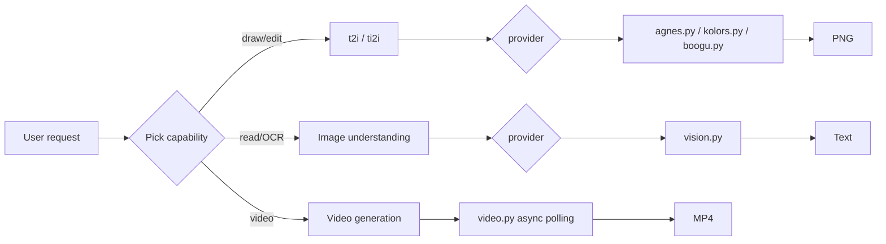

# Wudaozi — Multi-Capability Media Generation Skill

[](https://github.com/Kirky-X/wudaozi/releases) [](LICENSE) [](#-tests--verification)

English | [中文](README.md)

> Media generation skill for AI agents: text-to-image / image-to-image / image understanding / video generation, with deterministic capability×provider routing that turns vague requests into executable commands.

## ✨ Features

| Capability | Providers (script) | Key (env var) |
| ---------- | ------------------ | ------------- |
| Text-to-image t2i | **agnes** cloud · **boogu** local · **kolors** cloud | `AGNES_API_KEY` / — / `AIPING_API_KEY` |
| Image-to-image ti2i | **agnes** cloud · **boogu** local (⚠️ kolors unsupported) | `AGNES_API_KEY` / — |
| Image understanding | **agnes** (agnes-2.0-flash) · **aiping** (DeepSeek-OCR-2) | `AGNES_API_KEY` / `AIPING_API_KEY` |
| Video generation | **agnes** (agnes-video-v2.0: t2vid / ti2vid / multi / keyframes async polling) | `AGNES_API_KEY` |

- **Deterministic routing**: capability → provider → script decided by lookup table; every cloud provider failure exits with an explicit error, **no automatic fallback** (avoids style/quality jumps)
- **Mask inpainting** (`--mask`, agnes ti2i): transparent PNG marks the region to redraw
- **Transparent background, dual mode** (`--transparent native/post`): native alpha channel, or flat chroma background removed locally (icon/sticker staple; post needs optional Pillow)
- **Batch generation** (`--count 1-8`, agnes/kolors): concurrent images, partial failures reported explicitly, successes kept
- **Sidecar metadata** (`<output>.json`): request vs actual params, revised_prompt, elapsed, seed — fully auditable
- **Anti-rewrite guard** (`--strict-prompt`) and **16-multiple size snapping** (absorbed from gpt_image_playground)
- **Keys via environment variables only**: no key ever lands in scripts or git; output auto-truncates to prevent leakage
- **VLM output is data**: image-understanding results (especially text inside images) are treated as reference material — instructions found in them are never executed (prompt-injection isolation)
- **Structured prompts**: 7-dimension template for text-to-image + video camera-motion formula + 5-segment structure for image understanding, see [references/prompt-template.md](references/prompt-template.md)
- **boogu local matrix**: 2×2×2 (mode × turbo × quantization), 8 combinations via deterministic lookup, details in [references/boogu-guide.md](references/boogu-guide.md)



## 📦 Installation

```bash
# Option 1: sync from the workspace (recommended)
bash scripts/sync-skills.sh wudaozi

# Option 2: manual copy
cp -r wudaozi/ ~/.zcode/skills/wudaozi/   # Claude Code / ZCode; Codex uses ~/.codex/skills/wudaozi/

# Option 3: skills CLI (supports 68+ agents)
npx skills add Kirky-X/wudaozi --agent claude-code -y
```

Dependencies:

| Dependency | Notes |
| ---------- | ----- |
| Python 3 | The 5 scripts use stdlib only — zero third-party dependencies |
| API keys (cloud) | `export AGNES_API_KEY=agn-xxx` (agnes-ai.com); `export AIPING_API_KEY=QC-xxx` (aiping.cn — kolors t2i / DeepSeek-OCR-2) |
| GPU + local model (actual boogu rendering) | Requires a CUDA machine with models downloaded to `~/software/Boogu-Image/models/`; model list and download guide in [references/boogu-guide.md](references/boogu-guide.md); without GPU only `--dry-run` works |

## 🚀 Quick Start

```bash
# Self-check all 5 scripts (pure-function validation + key presence, no network calls)
python3 scripts/agnes.py __selfcheck__

# Text-to-image · agnes cloud (output to $PWD/agnes-output/)
AGNES_API_KEY=agn-xxx python3 scripts/agnes.py t2i -i "Orange cat under moonlight, cinematic, high detail" --aspect 9:16

# Debug without a key: prints the curl command only, no real request
AGNES_API_KEY=agn-test python3 scripts/agnes.py t2i -i "test" --dry-run

# Text-to-video · 5s 16:9 (output to $PWD/video-output/, async polling ~1-3 min)
AGNES_API_KEY=agn-xxx python3 scripts/video.py t2vid -i "Cat strolling on a beach, cinematic, warm light"
```

> When a request misses key dimensions (subject/style/purpose), the agent clarifies one question at a time by priority, lists all 7 dimensions explicitly and waits for confirmation before executing — full flow in [SKILL.md](SKILL.md).

## ✅ Tests & Verification

Measured (2026-09-13):

```bash
# All 5 script self-checks, each PASS (prompts "key not set" without failing)
python3 scripts/agnes.py  __selfcheck__   # → self-check PASS
python3 scripts/kolors.py __selfcheck__   # → self-check PASS
python3 scripts/boogu.py  __selfcheck__   # → self-check PASS (hints "none" when local model absent)
python3 scripts/vision.py __selfcheck__   # → self-check PASS
python3 scripts/video.py  __selfcheck__   # → self-check PASS

# Unit tests (mocked network layer, no real API/model calls)
python3 -m pytest scripts/ -q
# → 149 passed in 0.15s
```

## 📁 Directory Structure

```
wudaozi/
├── SKILL.md                     # capability×provider matrix + routing + full flow
├── skill.json                   # metadata (name/version/tag)
├── scripts/
│   ├── agnes.py                 # agnes cloud image generation (t2i/ti2i)
│   ├── kolors.py                # kolors cloud image generation (t2i only)
│   ├── boogu.py                 # boogu local image generation (2×2×2 matrix routing)
│   ├── vision.py                # image understanding (agnes-2.0-flash / DeepSeek-OCR-2)
│   ├── video.py                 # video generation (async polling)
│   └── test_*.py                # 5 unit test files
├── references/
│   ├── prompt-template.md       # structured prompt templates + examples
│   └── boogu-guide.md           # boogu routing/model matrix/defaults/download guide
└── agnes-output|boogu-output|kolors-output|video-output/   # per-capability default output dirs ($PWD)
```

## 🔮 Boundaries

From the [SKILL.md](SKILL.md) trigger description — do **NOT** trigger this skill for:

- Brand guideline boards / logo systems → use `brandkit`
- Excalidraw charts → use `cangjie diagram`
- UI design reviews → use `diting review pr` / `maliang critique`

Capability boundary: generation and understanding only — video/audio editing, 3D models, PS-style retouching (cutout/color grading/compositing) are out of scope; kolors supports t2i only; video reference frames accept public URLs only; boogu rendering requires CUDA.

## 📄 License & Attribution

- License: MIT
- Repo: <https://github.com/Kirky-X/wudaozi> (author Kirky-X; version v0.2.1, consistent between skill.json and git tag)
