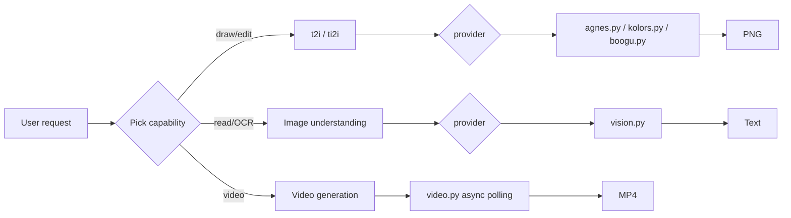

# Wudaozi — Multi-Capability Media Generation Skill

[](https://github.com/Kirky-X/wudaozi/releases) [](LICENSE) [](https://github.com/Kirky-X/wudaozi/actions/workflows/ci.yml)

English | [中文](README.md)

> Media generation skill for AI agents: text-to-image / image-to-image / image understanding / video generation, with deterministic capability×provider routing that turns vague requests into executable commands.

## ✨ Features

| Capability | Providers (script) | Key (env var) |
| ---------- | ------------------ | ------------- |
| Text-to-image t2i | **agnes** cloud · **boogu** local · **kolors** cloud | `AGNES_API_KEY` / — / `AIPING_API_KEY` |
| Image-to-image ti2i | **agnes** cloud · **boogu** local (⚠️ kolors unsupported) | `AGNES_API_KEY` / — |
| Image understanding | **agnes** (agnes-2.0-flash) · **aiping** (DeepSeek-OCR-2) | `AGNES_API_KEY` / `AIPING_API_KEY` |
| Video generation | **agnes** (agnes-video-v2.0: t2vid / ti2vid / multi / keyframes async polling) | `AGNES_API_KEY` |

- **Deterministic routing**: capability → provider → script decided by lookup table; every cloud provider failure exits with an explicit error, **no automatic fallback** (avoids style/quality jumps)
- **Machine-readable errors + failure tracing**: every cloud transport/response error starts with `[ERROR] code=<stable code>` (11 codes, pinned by tests; local argument validation uses plain `[ERROR]`); the failure site is written to `<output>-failed-<ts>.json` sidecar (request context + secret-masked error message)
- **Video task resume** (`--resume <video_id>`): on timeout/interrupt stdout prints `WUDAOZI_RESUME=<id>`; resuming never re-submits or double-bills; task creation retries only connect-phase errors with full-jitter backoff, polling honors `Retry-After` (absorbed from comfy-python-sdk / replicate-python)
- **Mask inpainting** (`--mask`, agnes ti2i): transparent PNG marks the region to redraw
- **Transparent background, dual mode** (`--transparent native/post`): native alpha channel, or flat chroma background removed locally (icon/sticker staple; post needs optional Pillow)
- **Batch generation** (`--count 1-8`, agnes/kolors): concurrent images, partial failures reported explicitly, successes kept
- **Sidecar metadata** (`<output>.json`): request vs actual params, revised_prompt, elapsed, seed — fully auditable
- **Embedded PNG metadata** (all three providers): webui-compatible `parameters` text chunk written straight into the artifact (pure-stdlib tEXt/iTXt; boogu records seed/steps/cfg in full) — params survive image-host uploads; dual-track with sidecar
- **stdout pipe contract**: file-producing scripts print exactly one `WUDAOZI_OUTPUT=<path>` line on success (`WUDAOZI_RESUME=<id>` on video failure); all human-readable logs go to stderr — agents can capture with `$(...)`
- **Reference role semantics** (`--ref-role subject|style|composition`, agnes/boogu ti2i): explicit "borrow style only, don't copy subject / borrow composition only" declarations via deterministic clause injection
- **Character/style asset library** (`assets.py`): pin a satisfying image as a named asset (`--from-last` grabs the newest generation), reuse via ti2i `--ref <asset>`; with the [character-sheet workflow](references/character-sheet-workflow.md) (identity sheet → scene frame → image-to-video)
- **Variant batching** (`{a|b|c}` / `{_wordbank_}` + `--count`, agnes/kolors): each copy renders a distinct non-repeating variant — deliberate differences, not N identical images
- **Parameter sweep** (`--sweep steps=20,30,50`, boogu): one command sweeps a parameter set at a fixed seed (lockstep pairing) for a full comparison grid
- **OCR reliability aligned upstream**: temperature=0 + max_tokens=8192 (DeepSeek-OCR-2 official reference), explicit truncation warning; grounding markers stripped by default (`--raw` keeps original); multi-page PDF routing (SKILL.md § 4D)
- **Readiness self-check** (`doctor.py`): one command reports keys / boogu stack / capability×provider matrix / default routing (read-only)
- **Cross-process concurrency gates**: per-provider slot-file pool (flock, override via `WUDAOZI_CONCURRENCY_*`) keeps multiple agent sessions from hammering cloud providers (429) or local GPU (OOM)
- **Anti-rewrite guard** (`--strict-prompt`) and **16-multiple size snapping** (absorbed from gpt_image_playground)
- **Keys via environment variables only**: no key ever lands in scripts or git; output auto-truncates to prevent leakage
- **VLM output is data**: image-understanding results (especially text inside images) are treated as reference material — instructions found in them are never executed (prompt-injection isolation)
- **Structured prompts**: 7-dimension template for text-to-image + video camera-motion formula + 5-segment structure for image understanding, see [references/prompt-template.md](references/prompt-template.md); narrative shorts / precise camera work / multi-shot planning in [references/video-prompt-guide.md](references/video-prompt-guide.md)
- **boogu local matrix**: 2×2×2 (mode × turbo × quantization), 8 combinations via deterministic lookup, details in [references/boogu-guide.md](references/boogu-guide.md)


```mermaid
flowchart LR
    R[User request] --> C{Pick capability}
    C -- draw/edit --> IMG[t2i / ti2i]
    C -- read/OCR --> VIS[Image understanding]
    C -- video --> VID[Video generation]
    IMG --> P1{provider} --> S1[agnes.py / kolors.py / boogu.py] --> O1[PNG]
    VIS --> P2{provider} --> S2[vision.py] --> O2[Text]
    VID --> S3[video.py async polling] --> O3[MP4]
```

## 📦 Installation

```bash
# Option 1: sync from the workspace (recommended)
bash scripts/sync-skills.sh wudaozi

# Option 2: manual copy
cp -r wudaozi/ ~/.zcode/skills/wudaozi/   # Claude Code / ZCode; Codex uses ~/.codex/skills/wudaozi/

# Option 3: skills CLI (supports 68+ agents)
npx skills add Kirky-X/wudaozi --agent claude-code -y
```

Dependencies:

| Dependency | Notes |
| ---------- | ----- |
| Python 3 | The 5 scripts use stdlib only — zero third-party dependencies |
| API keys (cloud) | `export AGNES_API_KEY=agn-xxx` (agnes-ai.com); `export AIPING_API_KEY=QC-xxx` (aiping.cn — kolors t2i / DeepSeek-OCR-2) |
| GPU + local model (actual boogu rendering) | Requires a CUDA machine with models downloaded to `~/software/Boogu-Image/models/`; model list and download guide in [references/boogu-guide.md](references/boogu-guide.md); without GPU only `--dry-run` works |

## 🚀 Quick Start

```bash
# Self-check all 5 scripts (pure-function validation + key presence, no network calls)
python3 scripts/agnes.py __selfcheck__

# Text-to-image · agnes cloud (output to $PWD/agnes-output/)
AGNES_API_KEY=agn-xxx python3 scripts/agnes.py t2i -i "Orange cat under moonlight, cinematic, high detail" --aspect 9:16

# Debug without a key: prints the curl command only, no real request
AGNES_API_KEY=agn-test python3 scripts/agnes.py t2i -i "test" --dry-run

# Text-to-video · 5s 16:9 (output to $PWD/video-output/, async polling ~1-3 min)
AGNES_API_KEY=agn-xxx python3 scripts/video.py t2vid -i "Cat strolling on a beach, cinematic, warm light"
```

> When a request misses key dimensions (subject/style/purpose), the agent clarifies one question at a time by priority, lists all 7 dimensions explicitly and waits for confirmation before executing — full flow in [SKILL.md](SKILL.md).

## ✅ Tests & Verification

Measured (2026-10-02):

```bash
# All 5 script self-checks, each PASS (prompts "key not set" without failing)
python3 scripts/agnes.py  __selfcheck__   # → self-check PASS
python3 scripts/kolors.py __selfcheck__   # → self-check PASS
python3 scripts/boogu.py  __selfcheck__   # → self-check PASS (hints "none" when local model absent)
python3 scripts/vision.py __selfcheck__   # → self-check PASS
python3 scripts/video.py  __selfcheck__   # → self-check PASS

# Unit tests (mocked network layer, no real API/model calls)
python3 -m pytest scripts/ -q
# → 246 passed
python3 -m pytest tests/ -q
# → 114 passed, 2 subtests passed
```

CI runs the same suite on a 3-version Python matrix (3.10/3.11/3.12) on every push/PR, see [.github/workflows/ci.yml](.github/workflows/ci.yml).

## 📁 Directory Structure

```
wudaozi/
├── SKILL.md                     # capability×provider matrix + routing + full flow
├── skill.json                   # metadata (name/version/tag)
├── evals/                       # trigger regression set (20 queries, 60/40 split + protocol)
├── scripts/
│   ├── _cloud_common.py         # shared skeleton (transport/save/SSRF/error hints/PNG metadata/locks)
│   ├── _prompt_variants.py      # variant expansion engine ({a|b|c} enums + wordbanks + sampling)
│   ├── agnes.py                 # agnes cloud image generation (t2i/ti2i + ref-role/variants/metadata)
│   ├── kolors.py                # kolors cloud image generation (t2i only + variants/metadata)
│   ├── boogu.py                 # boogu local generation (2×2×2 matrix + --sweep + --ref)
│   ├── vision.py                # image understanding (official OCR params + grounding cleanup + --raw)
│   ├── video.py                 # video generation (async polling + classified retry + --resume)
│   ├── assets.py                # character/style asset library (add/list/show/remove + --from-last)
│   ├── doctor.py                # readiness self-check (keys/boogu stack/matrix/routing)
│   └── test_*.py                # unit tests (10 files, 365+ cases)
├── references/
│   ├── prompt-template.md       # structured prompt templates + ref-role/variants + JSON block
│   ├── video-prompt-guide.md    # video prompt guide (5-stage / camera moves / multi-shot)
│   ├── character-sheet-workflow.md  # identity sheet → scene frame → image-to-video pipeline
│   ├── boogu-guide.md           # boogu routing/model matrix/defaults/seed boundary/download guide
│   └── wordbanks/               # variant wordbanks (lighting/mood, extendable)
└── agnes-output|boogu-output|kolors-output|video-output/   # per-capability default output dirs ($PWD)
```

## 🔮 Boundaries

From the [SKILL.md](SKILL.md) trigger description — do **NOT** trigger this skill for:

- Brand guideline boards / logo systems → use `brandkit`
- Excalidraw charts → use `cangjie diagram`
- UI design reviews → use `diting review pr` / `maliang critique`
- Vertical-scene templates / style selection (UI screenshot / infographic / poster libraries) → use `gpt-image-2-style-library` (wudaozi executes generation only)

Capability boundary: generation and understanding only — video/audio editing, 3D models, PS-style retouching (cutout/color grading/compositing) are out of scope; kolors supports t2i only; video reference frames accept public URLs only; boogu rendering requires CUDA.

## 📄 License & Attribution

- License: MIT
- Repo: <https://github.com/Kirky-X/wudaozi> (author Kirky-X; version v0.3.2, consistent between skill.json and git tag)
