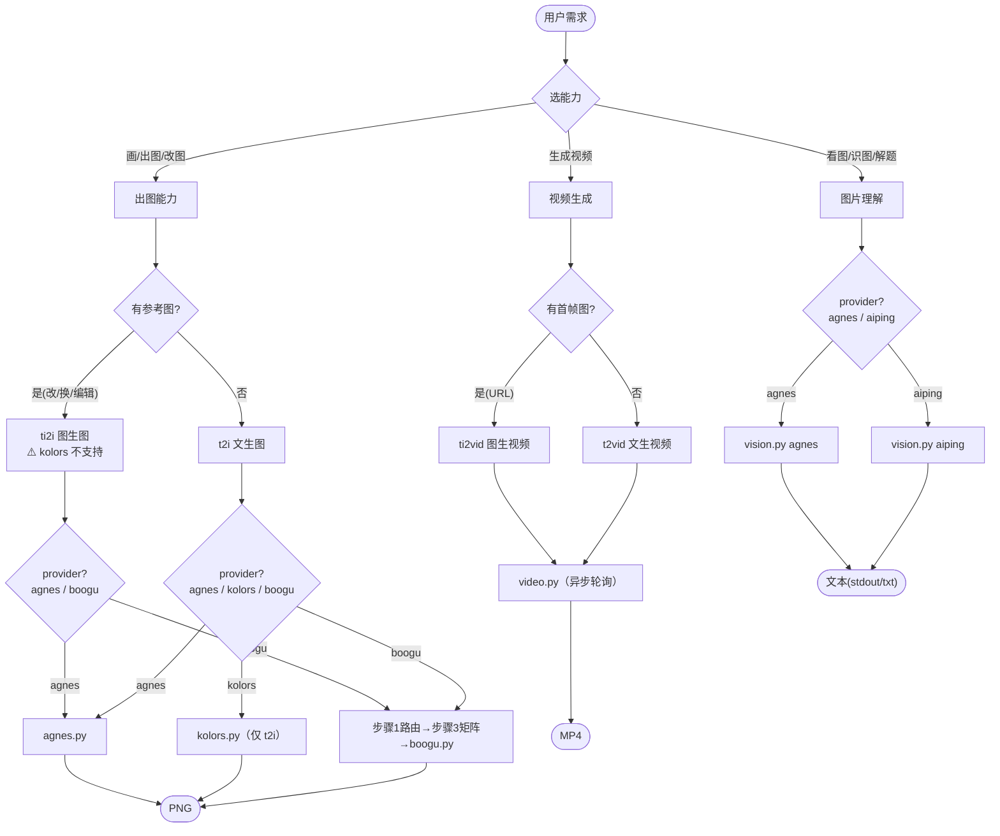

# wudaozi（吴道子）—— 多能力媒体生成技能

把用户的模糊媒体需求变成一条能跑的命令：**选能力 → 选 provider → 结构化 prompt → 调脚本**。

## 能力 × provider 矩阵

| 能力         | 触发关键词                       | provider（脚本）                                                       | key 环境变量        |
| ------------ | -------------------------------- | ---------------------------------------------------------------------- | ------------------- |
| 文生图 t2i   | 画/生成/AI画图/出图              | **agnes** 云端 · **boogu** 本地 · **kolors** 云端（aiping）            | `AGNES_API_KEY` / — / `AIPING_API_KEY` |
| 图生图 ti2i  | 改图/换背景/加元素/编辑这张      | **agnes** 云端 · **boogu** 本地（⚠️ kolors **不支持** ti2i）            | `AGNES_API_KEY` / — |
| 图片理解     | 看图/识图/这张图里有什么/解题/OCR | **agnes**（agnes-2.0-flash）· **aiping**（DeepSeek-OCR-2）              | `AGNES_API_KEY` / `AIPING_API_KEY` |
| 视频生成     | 生成视频/文生视频/图生视频       | **agnes**（agnes-video-v2.0，异步轮询）                                | `AGNES_API_KEY`     |

> 🔴 **CHECKPOINT · 能力边界**：本技能**只做生成与理解**。视频/音频剪辑、3D 模型、PS 类精修合成（抠图/调色/拼接）**不在范围**——这些不要硬塞给生成模型。

---

## Provider 选型（出图三 provider）

| 维度     | agnes 云端                       | kolors 云端（aiping）              | boogu 本地                       |
| -------- | -------------------------------- | ---------------------------------- | -------------------------------- |
| 能力     | t2i + ti2i                       | **仅 t2i**（无 ti2i）              | t2i + ti2i                       |
| 部署     | 配 `AGNES_API_KEY` 即用          | 配 `AIPING_API_KEY` 即用           | 需 GPU + 本地模型 + venv         |
| 速度     | 单图秒级                         | 单图秒级                           | base 分钟级 / turbo 秒级         |
| 显存     | 无要求                           | 无要求                             | 16GB+（fp8 可降到 ~8GB）         |
| 定制     | size/prompt                      | size/prompt                        | turbo/fp8/seed/steps/cfg 全开    |
| 隐私     | prompt/图上传云端                | prompt 上传云端                    | 全本地，不出机器                 |
| 失败处理 | 显式报错，不 fallback            | 显式报错，不 fallback              | 显式报错，不 fallback            |
| 适合     | 无 GPU / 快速出图                | 无 GPU / agnes 限流时备选          | 有 GPU / 隐私敏感 / 批量调参     |

**默认路由**：`AGNES_API_KEY` 已设 → 出图走 agnes、理解走 agnes、视频走 agnes；未设 → 问用户「配 key 还是 boogu 本地」。kolors 作为 agnes 限流/不可用时的 t2i 备选，需单独配 `AIPING_API_KEY`。

> 🔴 **CHECKPOINT**：本机 GPU 被 OS 拦截（NVML blocked），boogu 真出图须在有 CUDA 的机器跑（本机只能 `--dry-run`）。无 GPU 时走 agnes/kolors 云端即可真出图。

---

## 总体流程



所有能力共用**步骤 2 · 结构化 prompt**（见下）。出图走 boogu 时额外经过步骤 1（路由）和步骤 3（模型矩阵）；其余 provider 直接到步骤 4。

---

## 步骤 1 — 路由请求（仅 boogu）

> agnes / kolors / vision / video 跳过本步骤（无 turbo/fp8/seed/steps 概念）。

按 **参考图 → 速度 → 显存** 三段顺序判定。决策树优于表格（能表达判断先后）：


**关键词速查**（自然语言触发，配合决策树）：

| 用户说…                       | mode | turbo  | 量化   |
| ----------------------------- | ---- | ------ | ------ |
| "画/生成/AI 画图/出图"        | t2i  | 否     | 否     |
| "快速/草图/试几个版本/迭代"   | t2i  | **是** | 视显存 |
| "改图/换背景/加元素/编辑这张" | ti2i | 否     | 否     |
| "快速改图/批量编辑"           | ti2i | **是** | 视显存 |
| "显存不够/OOM/16G 显卡"       | —    | —      | **是** |

**默认决策**：未明示时 = `t2i + base + bf16 + 1:1 + 自动随机种子`。

> 🔴 **CHECKPOINT**：偏离默认（启用 turbo / fp8 / ti2i / 自定义尺寸）前，先与用户对齐原因（如"显存紧张建议 fp8"），获确认再进入步骤 2。

---

## 步骤 2 — 构造结构化 prompt

### 出图（agnes/boogu/kolors 共用）

读取 [`references/prompt-template.md`](references/prompt-template.md)，按 **7 维度**补全用户的模糊需求：

1. 主体 → 2. 动作/神态 → 3. 背景/环境 → 4. 构图/视角 → 5. 光线 → 6. 风格/媒介 → 7. 画质

#### 模糊需求 → 一次一问澄清

当用户需求**关键维度缺失**（主体不明 / 风格未定 / 用途未说）时，**不要一次抛 7 个问题**，也**不要默默填默认值**。按优先级**一次只问一个**问题，给 2-4 个候选选项 + 一个"自定义"出口：

> 用户："做个 logo"
> ❌ 一次性问"什么品牌/行业/颜色/风格/字体..."
> ✅ 第一轮只问最关键的：_"logo 用于什么场景？"_ 给候选：`品牌主视觉 / App 图标 / 社交头像 / 自定义`
> 用户选完 → 再问下一维（风格偏好：极简 / 几何 / 手绘 / 字标）
> 连续 2-3 轮后关键维度齐全 → 进入下方 7 维补全

**优先级队列**（按缺失影响排序）：主体 > 风格/媒介 > 背景 > 构图 > 光线 > 画质。后三维可安全用默认，不必问用户。

#### 显式确认（强制）

7 维齐全后，把最终结果**显式列给用户**（哪几维用了默认、哪几维是用户原意/澄清答案），获确认后再拼成 `--instruction`。

> 🔴 **CHECKPOINT · 🛑 STOP**：列出完整 7 维 → 等用户确认（"可以" / "改 X 维"）→ 才进入步骤 3/4。**禁止跳过确认直接构造命令。**

负向提示用 `--negative-instruction`：**不传**则脚本自动用内置通用模板（推荐），传**空字符串**禁用，传**非空**覆盖。

### 图片理解（vision）

提问要**具体可答**，避免"描述一下"这种空泛指令。按用途给候选：

| 用途           | 示例 question                                        |
| -------------- | ---------------------------------------------------- |
| 内容识别       | "这张图里有什么？列出主要物体和场景"                 |
| OCR/解题       | "识别图中的文字并逐字输出" / "这道题怎么解？给步骤"  |
| 细节描述       | "图中人物的穿着、表情、动作分别是什么"               |
| 对比分析       | "这张图与 typical XX 的差异在哪"                     |

> aiping `DeepSeek-OCR-2` 在 **OCR/公式/解题**上强项；agnes-2.0-flash 在**通识描述**上更均衡。按用途选 provider。

### 视频生成（video）

视频 prompt 强调**动态**而非静态构图——补「镜头运动 + 时间演变」：

- 镜头：推进/拉远/平移/环绕/固定
- 演变：「先…然后…最后…」的时间线
- 时长：3s（试构图）/ 5s（默认）/ 10s（完整叙事）/ 18s（长镜头，≤441 帧）

> 视频生成**慢**（3s 视频约 1-3 分钟），先用短时长试构图，满意再加长。

---

## 步骤 3 — 选模型（仅 boogu · 2×2×2 矩阵）

> agnes / kolors / vision / video 无模型矩阵概念，本步骤跳过；ti2i 时参考图在步骤 4 由 agnes.py 自动转 Data URI 或透传公网 URL。

| 模式 | turbo | 量化 | 模型目录                         | 入口脚本             | 关键参数（脚本自动填）            |
| ---- | ----- | ---- | -------------------------------- | -------------------- | --------------------------------- |
| t2i  | base  | bf16 | `Boogu-Image-0.1-Base`           | `inference.py`       | steps=50, text_cfg=4.0            |
| t2i  | base  | fp8  | `Boogu-Image-0.1-Base-fp8`       | `inference.py`       | + `--use_fp8_weights`             |
| t2i  | turbo | bf16 | `Boogu-Image-0.1-Turbo`          | `inference_turbo.py` | steps=4, cfg=1.0, dmd_sigma=0.001 |
| t2i  | turbo | fp8  | `Boogu-Image-0.1-Turbo-fp8`      | `inference_turbo.py` | 同上 + fp8                        |
| ti2i | base  | bf16 | `Boogu-Image-0.1-Edit`           | `inference.py`       | + image_cfg=1.0                   |
| ti2i | base  | fp8  | `Boogu-Image-0.1-Edit-fp8`       | `inference.py`       | 同上 + fp8                        |
| ti2i | turbo | bf16 | `Boogu-Image-0.1-Edit-Turbo`     | `inference_turbo.py` | dmd_sigma=0.0, empty_cfg=0.0      |
| ti2i | turbo | fp8  | `Boogu-Image-0.1-Edit-Turbo-fp8` | `inference_turbo.py` | 同上 + fp8                        |

**模型可用性**（脚本会自动探测并报错）：

- 本机已下载：`Base`、`Turbo`（仅 T2I 非量化）
- 需用户下载：`Edit` 系列（图生图）、全部 `-fp8` 系列
- 用户要图生图或 fp8 但本地无模型 → **不要硬跑**，明确告知"需先下载 models/{name}"，或降级到本地可用组合

---

## 步骤 4 — 调用脚本

### 4A · agnes 云端出图（`scripts/agnes.py`）

```bash
# 文生图（默认 url 下载 + 1:1，输出到 $PWD/agnes-output/）
AGNES_API_KEY=agn-xxx python3 scripts/agnes.py t2i -i "<结构化 instruction>"

# 竖屏手机壁纸
AGNES_API_KEY=agn-xxx python3 scripts/agnes.py t2i -i "<instruction>" --aspect 9:16

# 图生图（本地参考图自动转 base64，或传公网 URL）
AGNES_API_KEY=agn-xxx python3 scripts/agnes.py ti2i -i "把背景换成沙滩" --input photo.jpg

# 无 key / 调试：只看 curl 不真调
AGNES_API_KEY=agn-test python3 scripts/agnes.py t2i -i "<instruction>" --dry-run
```

agnes.py 自动：构造 `model/prompt/size(+参考图)` 请求 → POST agnes endpoint → 下载 URL 或解码 base64 存 PNG → key 截断防泄露。错误（401/429/400/超时/响应无 data）**显式报错并退出，不 fallback**——由用户决定重试或切 provider。

宽高比预设（与 boogu 同值）：`1:1` · `3:4`/`4:3` · `2:3`/`3:2` · `9:16`/`16:9`。agnes **不**做 16 对齐（云端黑盒，size 清单未知，HTTP 400 时换 `--aspect` 预设）。完整 CLI：`python3 scripts/agnes.py --help`。

### 4B · kolors 云端出图（`scripts/kolors.py`，⚠️ 仅 t2i）

```bash
# 文生图（输出到 $PWD/kolors-output/）
AIPING_API_KEY=QC-xxx python3 scripts/kolors.py t2i -i "<结构化 instruction>"

# 自定义尺寸（image_size 直接传 WxH）
AIPING_API_KEY=QC-xxx python3 scripts/kolors.py t2i -i "<instruction>" --image-size 1328x1328

# 用预设比例
AIPING_API_KEY=QC-xxx python3 scripts/kolors.py t2i -i "<instruction>" --aspect 9:16

# 调试
AIPING_API_KEY=QC-test python3 scripts/kolors.py t2i -i "<instruction>" --dry-run
```

> 🔴 **CHECKPOINT · kolors 硬约束**：kolors.py **只接受 t2i**（CLI `choices=["t2i"]`，传 ti2i 直接拒绝）。用户要图生图 → 走 agnes 或 boogu，**不要**尝试 kolors。size 用 `--image-size WxH` 或 `--aspect` 预设（`1:1`/`3:4`/`4:3`/`2:3`/`3:2`/`9:16`/`16:9`）；不传则服务端给默认。返回 `data[0].url` 下载，错误（401/429/400/超时）显式报错不 fallback。

### 4C · boogu 本地出图（`scripts/boogu.py`）

```bash
# 文生图（默认 base + bf16 + 1:1 + 自动种子，输出到 $PWD/boogu-output/）
python3 scripts/boogu.py t2i -i "<结构化 instruction>"

# turbo + 竖屏 + 指定种子（复现）
python3 scripts/boogu.py t2i -i "<instruction>" --turbo --aspect 9:16 --seed 42

# 图生图（编辑参考图），fp8 省显存
python3 scripts/boogu.py ti2i -i "把背景换成沙滩" --input photo.jpg --quantized

# 无 GPU / 调试：只看命令不真跑
python3 scripts/boogu.py t2i -i "<instruction>" --dry-run

# 自定义输出目录
python3 scripts/boogu.py t2i -i "<instruction>" -o ./my-output/
```

脚本会自动：

- 按 `(mode, turbo, quantized)` 选官方脚本与模型（确定性查找表）
- 填 turbo/base 默认参数差异（步数、CFG、dmd_sigma）
- 未指定 `--seed` 时生成随机种子并回显（便于复现）
- 输出路径默认 `$PWD/boogu-output/`，文件名含 mode+seed+尺寸+时间戳防覆盖
- 按 H×W 自动算 `max_input_image_pixels` 与 `max_input_image_side_length`（官方推荐公式，保证清晰度）
- 探测 venv/模型/GPU，缺失即明确报错并给修复建议

**宽高比预设**（全部 16 对齐，长边 ≤ 2048）：`1:1`(1024²) · `3:4`/`4:3`(1024×1360) · `2:3`/`3:2`(1024×1536) · `9:16`/`16:9`(1024×1824)。也可用 `--height/--width` 自定义（脚本会向下对齐 16）。

**关键参数覆盖**（一般用默认即可）：`--steps` `--text-guidance` `--dmd-sigma` `--device` `--negative-instruction`。完整清单 `python3 scripts/boogu.py --help`。

### 4D · 图片理解（`scripts/vision.py`）

```bash
# agnes 理解本地图（自动转 base64；实测 agnes 接受 data URI）
AGNES_API_KEY=agn-xxx python3 scripts/vision.py agnes --image photo.jpg -q "这张图里有什么"

# agnes 理解公网 URL 图
AGNES_API_KEY=agn-xxx python3 scripts/vision.py agnes --image https://example.com/a.jpg -q "描述这张图"

# aiping DeepSeek-OCR-2 解题/OCR
AIPING_API_KEY=QC-xxx python3 vision.py aiping --image math.png -q "这道题怎么解答？"

# 结果存 txt（默认正文打 stdout，便于管道读取）
AGNES_API_KEY=agn-xxx python3 scripts/vision.py agnes --image x.jpg -q "..." --output result.txt
```

vision.py 自动：本地路径 → base64 data URI，http(s) URL → 透传；构造 OpenAI 兼容 chat/completions（content array：image_url + text）→ 调对应 provider → 提取 content 打 stdout。两个 provider 文档/实测都接受 base64 data URI（agnes 文档说只支持 URL，实测 base64 也能用）。错误（401/429/400/超时）显式报错不 fallback。

### 4E · 视频生成（`scripts/video.py`，异步轮询）

```bash
# 文生视频，5s 16:9（默认）
AGNES_API_KEY=agn-xxx python3 scripts/video.py t2vid -i "猫在沙滩走，电影感，暖光"

# 3s 短视频试构图 + 反向提示
AGNES_API_KEY=agn-xxx python3 video.py t2vid -i "..." --duration 3s --aspect 16:9 \
    --negative-instruction "模糊, 变形"

# 图生视频（首帧图必须是公网 URL，不支持 base64）
AGNES_API_KEY=agn-xxx python3 video.py ti2vid -i "镜头缓慢推进" --image https://x/a.png

# 调试：只看创建任务 curl
AGNES_API_KEY=agn-xxx python3 video.py t2vid -i "..." --dry-run
```

video.py 异步流程：POST `/v1/videos` 创建任务拿 `video_id` → 轮询 `GET /agnesapi?video_id=X` 到 `completed`/`failed`/超时 → 下载 mp4 到 `$PWD/video-output/`。

> 🔴 **CHECKPOINT · 视频硬约束**：
> - **num_frames 须 8n+1**（81/121/241/441），≤441；frame_rate 1-60。入口校验拒绝，避免服务端 400。用 `--duration` 预设自动满足。
> - **ti2vid 的 `--image` 只接受公网 http(s) URL**（文档明确，视频生成不支持 base64）——本地图片须先传图床/OSS，或改用 t2vid。
> - 视频生成慢，`--max-wait` 默认 1200s（覆盖最长 18s 视频的生成耗时）；超时会打印 `video_id` 供手动 `curl` 查询。

---

## 默认值速查（boogu 出图）

| 维度                               | base | turbo                |
| ---------------------------------- | ---- | -------------------- |
| 步数                               | 50   | 4                    |
| text guidance                      | 4.0  | 1.0                  |
| image guidance（ti2i）             | 1.0  | 1.0                  |
| empty_instruction guidance（ti2i） | —    | 0.0                  |
| dmd_conditioning_sigma             | —    | t2i=0.001 / ti2i=0.0 |
| 用 CFG                             | 是   | 否（DMD 学生推理）   |
| 相对速度                           | 1×   | 约 10×               |

视频时长预设（num_frames, frame_rate，均 8n+1）：`3s`=(81,24) · `5s`=(121,24) · `10s`=(241,24) · `18s`=(441,24)。
视频分辨率预设（W,H）：`16:9`=(1152,768) · `9:16`=(768,1152) · `1:1`=(960,960) · `4:3`=(1024,768) · `3:4`=(768,1024)。

---

## 失败模式与 fallback

> 所有云端 provider（agnes/kolors/vision/video）失败均由对应脚本**显式报错并退出，不自动 fallback**；用户决定重试或切 provider。下表为 boogu 本地失败修复。

| 触发                  | 一线修复                                                         | 兜底                                               |
| --------------------- | ---------------------------------------------------------------- | -------------------------------------------------- |
| `[ERROR] 模型未下载`  | 提示用户下载对应模型到 `~/software/Boogu-Image/models/`          | 降级到本地已有模型（如 Edit 缺失 → 改走 t2i 重绘） |
| `[WARN] GPU 探测失败` | 加 `--dry-run` 验证命令；或 `--device cpu`（极慢，仅调试）       | 引导到有 CUDA 的机器跑                             |
| 显存 OOM              | 加 `--quantized`（fp8）                                          | 降尺寸：`--aspect 1:1` 或更小 `--height/--width`   |
| 出图模糊              | 检查是否设了过大 H×W 但 max_input 太小（脚本已按官方公式自动算） | 用 base 重出，或换更高分辨率预设                   |
| ti2i 改图"飞掉"       | 降 text_guidance、加 image_guidance                              | 用 base 而非 turbo（CFG 更可控）                   |
| 出图与预期不符        | 先调 prompt（七维是否齐全），再调 seed/步数                      | 同 seed 复现 + 单维调参                            |
| 视频轮询超时          | 加大 `--max-wait`，或用打印的 `video_id` 手动 `curl` 查询        | 改短时长（`--duration 3s`）减少生成耗时            |
| 视频文件 <10KB        | 任务异常完成，检查 prompt/seed，重跑                             | 换 `--aspect` 或 `--duration` 预设                 |

---

## 特殊场景：logo / IP 形象 / 产品衍生图

这三类是 **t2i 的专门子任务**，走同一个出图后端（agnes/kolors/boogu 均可），**仅 prompt 模板不同**。读 [`references/prompt-template.md`](references/prompt-template.md) 对应章节：

| 用户说…                         | 任务类型 | 模板章节                     | 推荐参数                                     |
| ------------------------------- | -------- | ---------------------------- | -------------------------------------------- |
| "做个 logo / 图标 / 品牌主视觉" | logo     | prompt-template.md § logo    | t2i，`--aspect 1:1`，简洁背景                |
| "做个 IP / 吉祥物 / 角色形象"   | IP 角色  | prompt-template.md § IP      | t2i，`--aspect 3:4` 或 `1:1`，3D/潮玩风      |
| "产品图 / 衍生图 / 周边视觉"    | 产品衍生 | prompt-template.md § product | t2i，`--aspect 4:3` 或 `1:1`，居中陈列       |

> ⚠️ 出图模型是**图像生成**模型，logo/图标类图形设计（精确几何、矢量文字）非其强项。出图是"插画感的 logo/角色"，**不是可用的矢量设计稿**。需精确矢量 logo → 用专门设计工具，不要硬跑。

---

## 执行反模式（触发后不要做的事）

- **不要默默填 7 维默认值跳过确认** —— 主体/风格/背景缺失时先用步骤 2 的"一次一问"澄清，确认后再拼 instruction。
- **不要在 CPU 上跑 turbo** —— 4 步 DMD 蒸馏在 CPU 上会发散，必须用 base 或换 GPU。
- **不要给 turbo 传 `--text-guidance != 1.0` 或 `--steps != 4`** —— 脚本会拒绝/warn（B11/B12 硬约束）。
- **不要用 fp8 跑高保真 ti2i 编辑** —— 量化损失细节，编辑类任务用 bf16。
- **不要单传 `--height` 不传 `--width`**（或反之）—— 脚本会拒绝（B1），单维改尺寸用 `--aspect`。
- **不要对非 fp8 模型加 `--quantized`**（或反之）—— 脚本会拒绝（B2，fp8 标志与模型目录必须一致）。
- **不要给 kolors 传 ti2i** —— kolors 硬件约束只支持 t2i，CLI 直接拒绝；图生图走 agnes/boogu。
- **不要给 ti2vid 传本地路径/base64** —— 视频生成 `--image` 只接受公网 URL；本地图先传图床。
- **不要传非 8n+1 的 num_frames 给视频** —— 入口校验拒绝；用 `--duration` 预设自动满足。

---

## 不要触发本技能

- 用户只是要**找/看/筛选已有图片**（不生成、不理解）。
- 用户要的是**音频/3D 模型**生成（本技能只做 2D 图 + 视频）。
- 用户要**精修/合成现有图片**（PS 类操作，如抠图、调色、拼接）→ 用图像处理工具，不是生成模型。
- 用户要**视频剪辑**（裁剪/拼接/加字幕已有视频）→ 本技能只**生成**视频，不做剪辑。
- 本地无 GPU 且用户不愿/不能到 CUDA 机器跑 boogu → boogu 只能 `--dry-run`，**不要假装出图**（可走 agnes/kolors 云端）。

---

## 自检

```bash
python3 scripts/agnes.py  __selfcheck__   # 出图 agnes：纯函数 + key 存在性
python3 scripts/kolors.py __selfcheck__   # 出图 kolors：纯函数 + image_size 表 + key 存在性
python3 scripts/boogu.py  __selfcheck__   # 出图 boogu：矩阵查表/16 对齐/资源探测
python3 scripts/vision.py __selfcheck__   # 图片理解：双 provider 表 + data URI + key 存在性
python3 scripts/video.py  __selfcheck__   # 视频生成：8n+1 规则 + 分辨率/时长预设 + key 存在性
python3 -m pytest scripts/               # 全量单元测试（5 脚本，不打真实 API/模型）
```
