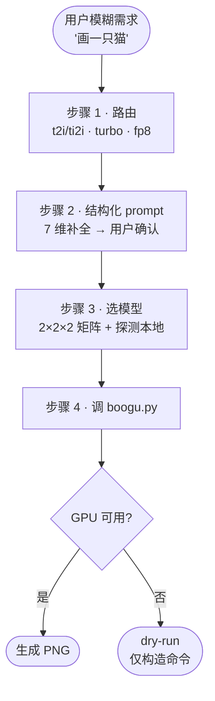
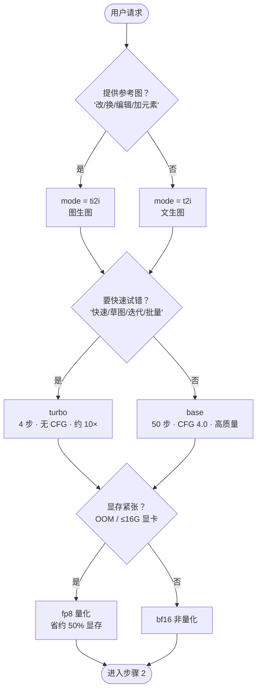

# wudaozi（吴道子）—— Boogu-Image 出图技能

把用户的模糊图片需求（"画一只猫"）变成一张能跑的命令：**结构化 prompt → 选模型 → 填参数 → 调脚本**。

封装 `~/software/Boogu-Image`（8 组模型矩阵 + DMD turbo 范式 + fp8 量化）。模型选择、种子、宽高比、输出路径全部由 [`scripts/boogu.py`](scripts/boogu.py) 确定性处理，**不交给模型猜**。

> 🔴 **CHECKPOINT**：本机当前 GPU 被 OS 拦截（NVML blocked），无法真出图。能做的是 `--dry-run` 构造并展示命令；真出图须在有 CUDA 的机器上跑。本地仅下载了 `Boogu-Image-0.1-Base` 与 `Boogu-Image-0.1-Turbo`（均 T2I 非量化），其余 6 组模型需用户下载或自动降级（见下方"模型可用性"）。

---

## 总体流程



---

## 步骤 1 — 路由请求

按 **参考图 → 速度 → 显存** 三段顺序判定。决策树优于表格（能表达判断先后）：



**关键词速查**（自然语言触发，配合决策树）：

| 用户说…                       | mode | turbo  | 量化   |
| ----------------------------- | ---- | ------ | ------ |
| "画/生成/AI 画图/出图"        | t2i  | 否     | 否     |
| "快速/草图/试几个版本/迭代"   | t2i  | **是** | 视显存 |
| "改图/换背景/加元素/编辑这张" | ti2i | 否     | 否     |
| "快速改图/批量编辑"           | ti2i | **是** | 视显存 |
| "显存不够/OOM/16G 显卡"       | —    | —      | **是** |

**默认决策**：未明示时 = `t2i + base + bf16 + 1:1 + 自动随机种子`。

> 🔴 **CHECKPOINT**：偏离默认（启用 turbo / fp8 / ti2i / 自定义尺寸）前，先与用户对齐原因（如"显存紧张建议 fp8"），获确认再进入步骤 2。

---

## 步骤 2 — 构造结构化 prompt

读取 [`references/prompt-template.md`](references/prompt-template.md)，按 **7 维度**补全用户的模糊需求：

1. 主体 → 2. 动作/神态 → 3. 背景/环境 → 4. 构图/视角 → 5. 光线 → 6. 风格/媒介 → 7. 画质

### 模糊需求 → 一次一问澄清

当用户需求**关键维度缺失**（主体不明 / 风格未定 / 用途未说）时，**不要一次抛 7 个问题**，也**不要默默填默认值**。按优先级**一次只问一个**问题，给 2-4 个候选选项 + 一个"自定义"出口：

> 用户："做个 logo"
> ❌ 一次性问"什么品牌/行业/颜色/风格/字体..."
> ✅ 第一轮只问最关键的：_"logo 用于什么场景？"_ 给候选：`品牌主视觉 / App 图标 / 社交头像 / 自定义`
> 用户选完 → 再问下一维（风格偏好：极简 / 几何 / 手绘 / 字标）
> 连续 2-3 轮后关键维度齐全 → 进入下方 7 维补全

**优先级队列**（按缺失影响排序）：主体 > 风格/媒介 > 背景 > 构图 > 光线 > 画质。后三维可安全用默认，不必问用户。

### 显式确认（强制）

7 维齐全后，把最终结果**显式列给用户**（哪几维用了默认、哪几维是用户原意/澄清答案），获确认后再拼成 `--instruction`。

> 🔴 **CHECKPOINT · 🛑 STOP**：列出完整 7 维 → 等用户确认（"可以" / "改 X 维"）→ 才进入步骤 3。**禁止跳过确认直接构造命令。**

例子：用户说"画一个拾荒老人" →

> 主体：满脸沧桑的老年拾荒者，皮肤黝黑
> 动作：低头整理编织袋，神态疲惫
> 背景：城市街头，远处有垃圾桶与红绿灯
> 构图：35mm 街拍，平视，三分法偏左
> 光线：阴天柔光
> 风格：徕卡街拍，胶片颗粒
> 画质：高细节，摄影质感
>
> 拼接 instruction：「一位满脸沧桑的老年拾荒者，皮肤黝黑，皱纹深刻，低头整理编织袋……」（见 prompt-template.md 案例 A 完整版）

负向提示用 `--negative-instruction`：**不传**则脚本自动用内置通用模板（推荐），传**空字符串**禁用，传**非空**覆盖。

---

## 步骤 3 — 选模型（2×2×2 矩阵）

| 模式 | turbo | 量化 | 模型目录                         | 入口脚本             | 关键参数（脚本自动填）            |
| ---- | ----- | ---- | -------------------------------- | -------------------- | --------------------------------- |
| t2i  | base  | bf16 | `Boogu-Image-0.1-Base`           | `inference.py`       | steps=50, text_cfg=4.0            |
| t2i  | base  | fp8  | `Boogu-Image-0.1-Base-fp8`       | `inference.py`       | + `--use_fp8_weights`             |
| t2i  | turbo | bf16 | `Boogu-Image-0.1-Turbo`          | `inference_turbo.py` | steps=4, cfg=1.0, dmd_sigma=0.001 |
| t2i  | turbo | fp8  | `Boogu-Image-0.1-Turbo-fp8`      | `inference_turbo.py` | 同上 + fp8                        |
| ti2i | base  | bf16 | `Boogu-Image-0.1-Edit`           | `inference.py`       | + image_cfg=1.0                   |
| ti2i | base  | fp8  | `Boogu-Image-0.1-Edit-fp8`       | `inference.py`       | 同上 + fp8                        |
| ti2i | turbo | bf16 | `Boogu-Image-0.1-Edit-Turbo`     | `inference_turbo.py` | dmd_sigma=0.0, empty_cfg=0.0      |
| ti2i | turbo | fp8  | `Boogu-Image-0.1-Edit-Turbo-fp8` | `inference_turbo.py` | 同上 + fp8                        |

**模型可用性**（脚本会自动探测并报错）：

- 本机已下载：`Base`、`Turbo`（仅 T2I 非量化）
- 需用户下载：`Edit` 系列（图生图）、全部 `-fp8` 系列
- 用户要图生图或 fp8 但本地无模型 → **不要硬跑**，明确告知"需先下载 models/{name}"，或降级到本地可用组合

---

## 步骤 4 — 调用脚本

```bash
# 文生图（默认 base + bf16 + 1:1 + 自动种子，输出到 $PWD/boogu-output/）
python3 scripts/boogu.py t2i -i "<结构化 instruction>"

# turbo + 竖屏 + 指定种子（复现）
python3 scripts/boogu.py t2i -i "<instruction>" --turbo --aspect 9:16 --seed 42

# 图生图（编辑参考图），fp8 省显存
python3 scripts/boogu.py ti2i -i "把背景换成沙滩" --input photo.jpg --quantized

# 无 GPU / 调试：只看命令不真跑
python3 scripts/boogu.py t2i -i "<instruction>" --dry-run

# 自定义输出目录
python3 scripts/boogu.py t2i -i "<instruction>" -o ./my-output/
```

脚本会自动：

- 按 `(mode, turbo, quantized)` 选官方脚本与模型（确定性查找表）
- 填 turbo/base 默认参数差异（步数、CFG、dmd_sigma）
- 未指定 `--seed` 时生成随机种子并回显（便于复现）
- 输出路径默认 `$PWD/boogu-output/`，文件名含 mode+seed+尺寸+时间戳防覆盖
- 按 H×W 自动算 `max_input_image_pixels` 与 `max_input_image_side_length`（官方推荐公式，保证清晰度）
- 探测 venv/模型/GPU，缺失即明确报错并给修复建议

**宽高比预设**（全部 16 对齐，长边 ≤ 2048）：`1:1`(1024²) · `3:4`/`4:3`(1024×1360) · `2:3`/`3:2`(1024×1536) · `9:16`/`16:9`(1024×1824)。也可用 `--height/--width` 自定义（脚本会向下对齐 16）。

**关键参数覆盖**（一般用默认即可）：`--steps` `--text-guidance` `--dmd-sigma` `--device` `--negative-instruction`。完整清单 `python3 scripts/boogu.py --help`。

---

## 默认值速查

| 维度                               | base | turbo                |
| ---------------------------------- | ---- | -------------------- |
| 步数                               | 50   | 4                    |
| text guidance                      | 4.0  | 1.0                  |
| image guidance（ti2i）             | 1.0  | 1.0                  |
| empty_instruction guidance（ti2i） | —    | 0.0                  |
| dmd_conditioning_sigma             | —    | t2i=0.001 / ti2i=0.0 |
| 用 CFG                             | 是   | 否（DMD 学生推理）   |
| 相对速度                           | 1×   | 约 10×               |

---

## 失败模式与 fallback

| 触发                  | 一线修复                                                         | 兜底                                               |
| --------------------- | ---------------------------------------------------------------- | -------------------------------------------------- |
| `[ERROR] 模型未下载`  | 提示用户下载对应模型到 `~/software/Boogu-Image/models/`          | 降级到本地已有模型（如 Edit 缺失 → 改走 t2i 重绘） |
| `[WARN] GPU 探测失败` | 加 `--dry-run` 验证命令；或 `--device cpu`（极慢，仅调试）       | 引导到有 CUDA 的机器跑                             |
| 显存 OOM              | 加 `--quantized`（fp8）                                          | 降尺寸：`--aspect 1:1` 或更小 `--height/--width`   |
| 出图模糊              | 检查是否设了过大 H×W 但 max_input 太小（脚本已按官方公式自动算） | 用 base 重出，或换更高分辨率预设                   |
| ti2i 改图"飞掉"       | 降 text_guidance、加 image_guidance                              | 用 base 而非 turbo（CFG 更可控）                   |
| 出图与预期不符        | 先调 prompt（七维是否齐全），再调 seed/步数                      | 同 seed 复现 + 单维调参                            |

---

## 特殊场景：logo / IP 形象 / 产品衍生图

这三类是 **t2i 的专门子任务**，走同一个 Boogu-Image t2i 后端，**仅 prompt 模板不同**（不绑定任何外部 API）。读 [`references/prompt-template.md`](references/prompt-template.md) 对应章节：

| 用户说…                         | 任务类型 | 模板章节                     | 推荐参数                                     |
| ------------------------------- | -------- | ---------------------------- | -------------------------------------------- |
| "做个 logo / 图标 / 品牌主视觉" | logo     | prompt-template.md § logo    | t2i base，`--aspect 1:1`，简洁背景           |
| "做个 IP / 吉祥物 / 角色形象"   | IP 角色  | prompt-template.md § IP      | t2i base，`--aspect 3:4` 或 `1:1`，3D/潮玩风 |
| "产品图 / 衍生图 / 周边视觉"    | 产品衍生 | prompt-template.md § product | t2i base，`--aspect 4:3` 或 `1:1`，居中陈列  |

> ⚠️ Boogu-Image 是**图像生成**模型，logo/图标类图形设计（精确几何、矢量文字）非其强项。出图是"插画感的 logo/角色"，**不是可用的矢量设计稿**。需精确矢量 logo → 用专门设计工具，不要硬跑。

---

## 执行反模式（触发后不要做的事）

- **不要默默填 7 维默认值跳过确认** —— 主体/风格/背景缺失时先用步骤 2 的"一次一问"澄清，确认后再拼 instruction。
- **不要在 CPU 上跑 turbo** —— 4 步 DMD 蒸馏在 CPU 上会发散，必须用 base 或换 GPU。
- **不要给 turbo 传 `--text-guidance != 1.0` 或 `--steps != 4`** —— 脚本会拒绝/warn（B11/B12 硬约束）。
- **不要用 fp8 跑高保真 ti2i 编辑** —— 量化损失细节，编辑类任务用 bf16。
- **不要单传 `--height` 不传 `--width`**（或反之）—— 脚本会拒绝（B1），单维改尺寸用 `--aspect`。
- **不要对非 fp8 模型加 `--quantized`**（或反之）—— 脚本会拒绝（B2，fp8 标志与模型目录必须一致）。

---

## 不要触发本技能

- 用户只是要**找/看/筛选已有图片**（不生成）。
- 用户要的是**视频/音频/3D 模型**生成（Boogu 只出 2D 静图）。
- 用户要**精修/合成现有图片**（PS 类操作，如抠图、调色、拼接）→ 用图像处理工具，不是生成模型。
- 本地无 GPU 且用户不愿/不能到 CUDA 机器跑 → 只能 `--dry-run`，**不要假装出图**。

---

## 自检

```bash
python3 scripts/boogu.py __selfcheck__   # 验证矩阵查表/16 对齐/资源探测，不依赖 GPU
```
