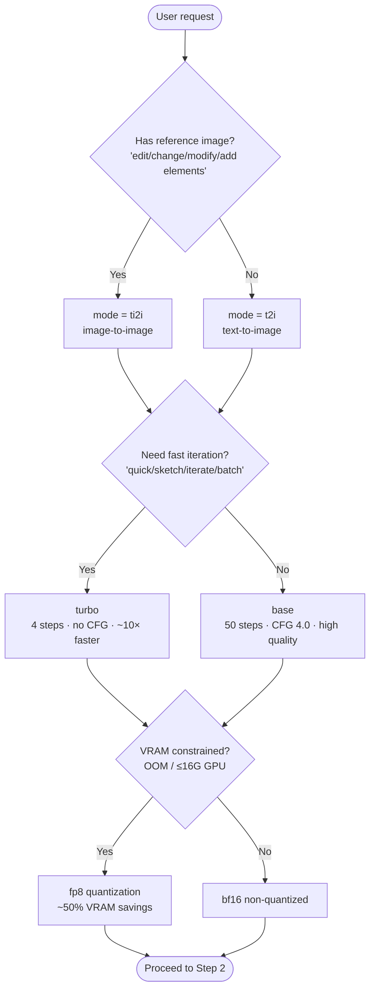

# Boogu Local Image Generation — Detailed Guide

> 从 SKILL.md 下沉的 boogu 专属细节：路由决策树、模型矩阵、默认值速查。agnes/kolors/vision/video 用户无需读本文件。

## Route Request — Decision Tree & Keywords

Determined in order by **reference image → speed → VRAM**. Decision tree is preferred over table (expresses judgment priority):

**Keyword quick reference** (natural language triggers, works with decision tree):

| User says... | mode | turbo | Quantization |
|-------------|------|-------|--------------|
| "draw/generate/AI drawing/output image" | t2i | No | No |
| "quick/sketch/try versions/iterate" | t2i | **Yes** | Depends on VRAM |
| "edit image/change background/add elements/edit this" | ti2i | No | No |
| "quick edit/batch editing" | ti2i | **Yes** | Depends on VRAM |
| "VRAM insufficient/OOM/16G GPU" | — | — | **Yes** |

**Default decision**: When not specified = `t2i + base + bf16 + 1:1 + auto random seed`.

> 🔴 **CHECKPOINT**: Before deviating from defaults (enabling turbo / fp8 / ti2i / custom dimensions), first align with user on the reason (e.g., "VRAM constrained, recommend fp8"), get confirmation, then proceed to Step 2.

---

---

## Model Matrix (2×2×2)

| Mode | turbo | Quantization | Model Directory | Entry Script | Key Parameters (auto-filled by script) |
|------|-------|--------------|-----------------|--------------|----------------------------------------|
| t2i | base | bf16 | `Boogu-Image-0.1-Base` | `inference.py` | steps=50, text_cfg=4.0 |
| t2i | base | fp8 | `Boogu-Image-0.1-Base-fp8` | `inference.py` | + `--use_fp8_weights` |
| t2i | turbo | bf16 | `Boogu-Image-0.1-Turbo` | `inference_turbo.py` | steps=4, cfg=1.0, dmd_sigma=0.001 |
| t2i | turbo | fp8 | `Boogu-Image-0.1-Turbo-fp8` | `inference_turbo.py` | Same as above + fp8 |
| ti2i | base | bf16 | `Boogu-Image-0.1-Edit` | `inference.py` | + image_cfg=1.0 |
| ti2i | base | fp8 | `Boogu-Image-0.1-Edit-fp8` | `inference.py` | Same as above + fp8 |
| ti2i | turbo | bf16 | `Boogu-Image-0.1-Edit-Turbo` | `inference_turbo.py` | dmd_sigma=0.0, empty_cfg=0.0 |
| ti2i | turbo | fp8 | `Boogu-Image-0.1-Edit-Turbo-fp8` | `inference_turbo.py` | Same as above + fp8 |

**Model availability** (scripts auto-detect and report errors):

- Locally downloaded: `Base`, `Turbo` (T2I non-quantized only)
- Requires user download: `Edit` series (image-to-image), all `-fp8` series
- User wants image-to-image or fp8 but no local model → **don't force run**, clearly inform "must download models/{name} first", or degrade to locally available combinations

---

---

## Defaults Quick Reference

| Dimension | base | turbo |
|-----------|------|-------|
| Steps | 50 | 4 |
| text guidance | 4.0 | 1.0 |
| image guidance (ti2i) | 1.0 | 1.0 |
| empty_instruction guidance (ti2i) | — | 0.0 |
| dmd_conditioning_sigma | — | t2i=0.001 / ti2i=0.0 |
| Use CFG | Yes | No (DMD student inference) |
| Relative speed | 1× | ~10× |

Video duration presets (num_frames, frame_rate, all 8n+1): `3s`=(81,24) · `5s`=(121,24) · `10s`=(241,24) · `18s`=(441,24).
Video resolution presets (W,H): `16:9`=(1152,768) · `9:16`=(768,1152) · `1:1`=(960,960) · `4:3`=(1024,768) · `3:4`=(768,1024).

---
