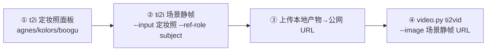

# Character Sheet Workflow — 定妆照 → 场景静帧 → 图生视频 三段一致性

> 「角色定妆照→场景静帧→图生视频」的显式管线。适用：IP 角色/真人形象需要**跨姿势、跨场景、跨镜头**保持可辨识时。单张图一次性出图不需要本流程。
>
> 结构吸收自 [Square-Zero-Labs/video-prompting-skill](https://github.com/Square-Zero-Labs/video-prompting-skill)（Apache-2.0）的 character-sheets 工作流与 identity sheet 模式；本文全部措辞为本仓库自著。三段执行能力 wudaozi 全部已具备（t2i / ti2i / video.py），本文只做编排。

## 触发词条

用户说「定妆照 / character sheet / turnaround / 三视图 / 多角度设定 / 让这个角色走进 XX 场景动起来」→ 走本工作流。

## 管线总览



三段逐步收窄自由度：①锚定身份 → ②锚定场景与构图 → ③只让时间维度动起来。跳段直接 t2vid 生成角色是身份漂移的最大来源。

---

## ① 定妆照面板（t2i）

一张图里排布同一角色的多角度视图，作为后续所有段的身份基准。

```
A character reference sheet of [身份锚点，先于一切风格描述], multiple views of the
same character: front view, three-quarter view, side view, back view arranged left to right,
plus a row of facial expressions (neutral, smiling, alert).
The same character, same outfit, same proportions in every view.
Plain light-gray background, even studio lighting, full-body, no cropping.
```

要点：

- **身份锚点前置**（[`prompt-template.md`](prompt-template.md) § IP 角色一致性三件套第 1 条）：脸型/发型/服装识别点写在最前，风格化描述放后。
- 推荐参数：`t2i --aspect 16:9`（横向排布多视图）或 `3:4`（单列）；agnes 加 `--count` + 变体语法批量出候选。
- 满意后立即钉成资产：`python3 scripts/assets.py add <角色名> --kind character --from-last`——后续所有段用 `--ref <角色名>` 引用，不靠记忆复述外观。

**真人实拍风格（photoreal identity sheet）**：真人一致性比卡通角色难（模型倾向"美化均值脸"），两句话措辞可显著抑制：

```
the same person photographed repeatedly, natural human asymmetry preserved
```

（"同一人反复拍摄"锚定身份复用；"保留自然的人脸不对称"防模型把每帧脸纠偏成对称模板脸。）

**只换装不动人（wardrobe-only update）**：需要同一角色的不同服装时，ti2i 指令里把"人"整体划入保留区、只授权服装变化：

> Keep the person's face, hairstyle, body proportions, and pose exactly unchanged; replace only the outfit with [新服装描述]. Same character identity as the reference image.

---

## ② 场景静帧（ti2i）

拿定妆照当参考图，生成"角色站在目标场景里"的静帧——它是第③段的视频首帧。

```bash
# agnes：本地定妆照自动转 base64；--ref-role subject 声明"参考图即角色本人"
AGNES_API_KEY=agn-xxx python3 scripts/agnes.py ti2i \
    -i "同一角色站在霓虹雨夜街头，半身，回望镜头，保持面部与发型不变" \
    --input character-sheet.png --ref-role subject

# 或引用资产库（character 资产默认就是 subject 角色，免 --ref-role）
AGNES_API_KEY=agn-xxx python3 scripts/agnes.py ti2i -i "..." --ref hero
```

要点：

- `--ref-role subject`（默认）= 参考图是角色本身；切勿在此用 `style`——那是"只借画风勿抄主体"，会把角色换掉。
- 保留声明照 [`prompt-template.md`](prompt-template.md) § ti2i 四元素：先写要什么变化，再写什么不能变（脸/发型/服装）。
- boogu 同样支持：`python3 scripts/boogu.py ti2i -i "..." --ref hero --quantized`。

## ③ 上传断点（本地产物 → 公网 URL）

视频生成只接受公网 http(s) URL（模型侧硬约束，不支持 base64）。第②段的产物在本机，这是管线上唯一的**人工断点**：

- 上传目标**由用户指定**（自有 OSS/图床/对象存储），wudaozi 不默认第三方图床、不自动上传。
- 上传后把 URL 交给 `video.py --image`；URL 必须无需登录即可访问（带鉴权的 URL 是静默失败源）。

## ④ 图生视频（video.py ti2vid）

```bash
AGNES_API_KEY=agn-xxx python3 scripts/video.py ti2vid \
    -i "角色缓缓转头看向镜头，雨滴落下，霓虹灯闪烁，镜头缓慢推进，面部与服装保持一致" \
    --image https://your-oss/scene-frame.png --duration 5s
```

要点：

- 指令描述"动什么 + 什么保持稳定"（[`prompt-template.md`](prompt-template.md) § Video Generation），**身份识别点在指令里再锚一次**——首帧已提供外观，指令只需强调"保持"。
- 时长纪律：先用 `3s` 验证动作与一致性，满意再延长（规则同 SKILL.md 视频节）。

---

## Checklist

- [ ] 定妆照面板的身份锚点写在最前（先于风格化描述）？
- [ ] 定妆照已 `assets.py add --from-last` 钉成资产（而不是每段重新描述外观）？
- [ ] 第②段用了 `--ref-role subject`（或 character 资产默认），没用成 `style`？
- [ ] 真人风格加了两句锚定措辞（same person photographed repeatedly / natural asymmetry）？
- [ ] 第③段上传目标由用户指定，URL 公网可访问？
- [ ] 第④段先 3s 验证再延长，指令里重申了"保持不变"的身份点？
